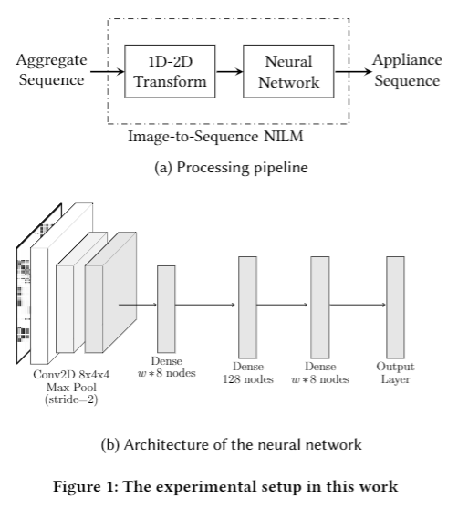
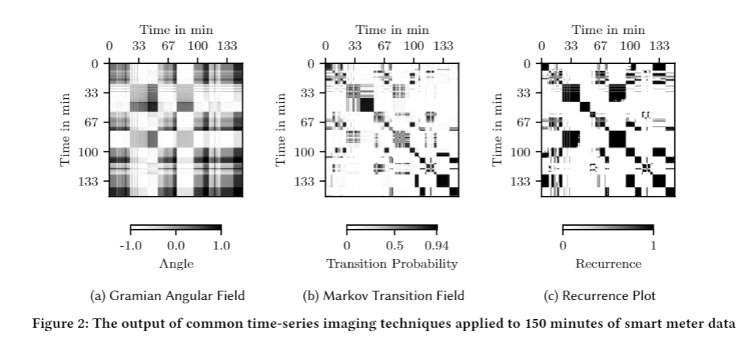

# Exploring Time Series Imaging for Load Disaggregation

The repository at hand contains the python code relative to our BuildSys20' paper
> Hafsa Bousbiat, Christoph Klemenjak, and Wilfried Elmenreich. 2020. [Exploring Time Series Imaging for Load Disaggregation.]([https://klemenjak.github.io/publication/2020-10-20-imaging](https://mobile.aau.at/publications/bousbiat-buildsys20-imaging.pdf)) In The 7th ACM International Conference on Systems for Energy-Efficient Buildings, Cities, and Transportation (BuildSys ’20), November 18–20, 2020, Virtual Event, Japan.

## Proposed Approach
Many wide-spread load disaggregation techniques perform a sequence-to-sequence mapping between an input sequence (aggregate power readings) and an output sequence that consists of power readings associated with a particular electrical appliance. We propose to augment this pipeline with a 1D-2D transform: a time series imaging block, as illustrated by the figure below. 

<p align="center">
  
</p>


The proposed approach, which we refer to as Image-to-Sequence (I2S), was designed to be fully  compatible to [NILMTK](https://github.com/nilmtk/nilmtk)
, a NILM toolkit for reproducible experiments. I2S incorporates implementations of GAF, MTF, and RP provided by the [PyTS](https://github.com/johannfaouzi/pyts) package. We provide below three sample images created from 150 minutes of smart meter data to get a sense of how images obtained from GASF, MTF and RP differ. All three transforms generate symmetric images where the value of a pixel gives insights on the similarity between two instants.




## Reference

```
 @inproceedings{bousbiat2020imaging,
  title={Exploring Time Series Imaging for Load Disaggregation},
  author={Bousbiat, Hafsa and Klemenjak, Christoph  and Elmenreich, Wilfried},
  booktitle={Proceedings of the 7th ACM International Conference on Systems for Energy-Efficient Buildings, Cities, and Transportation},
  year={2020}
}
```


